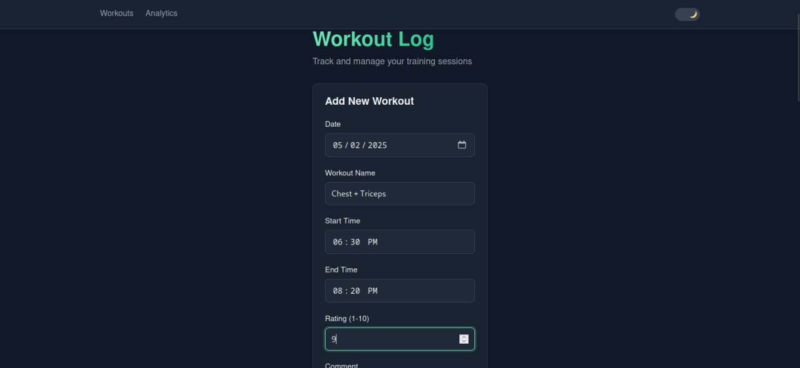
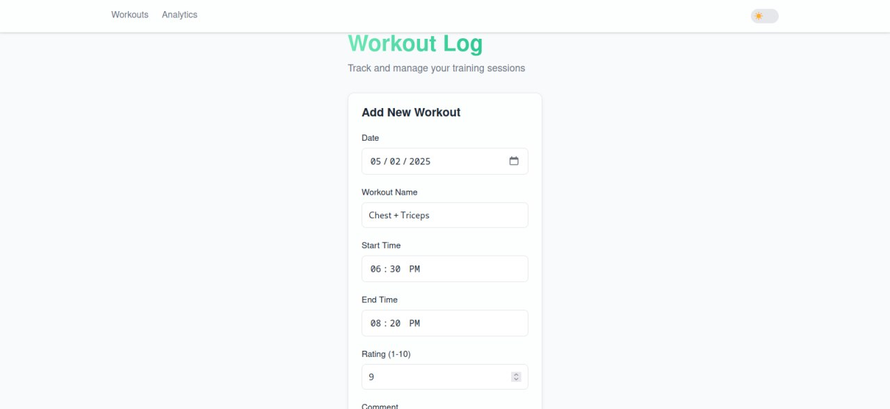
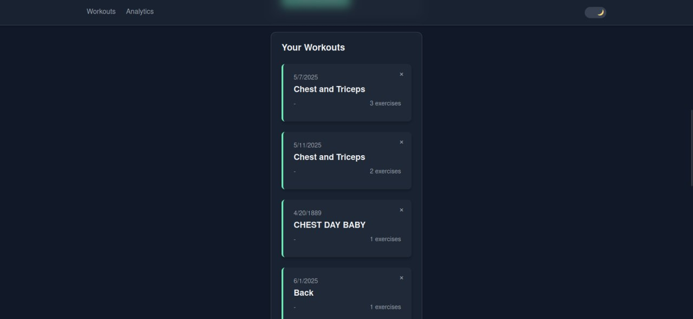
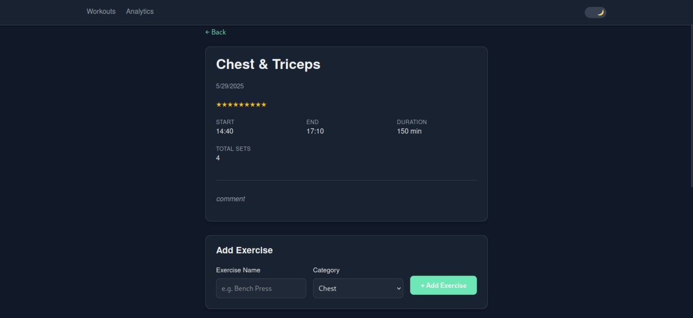
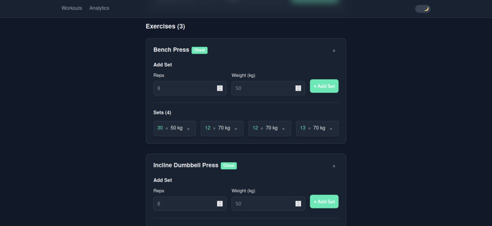
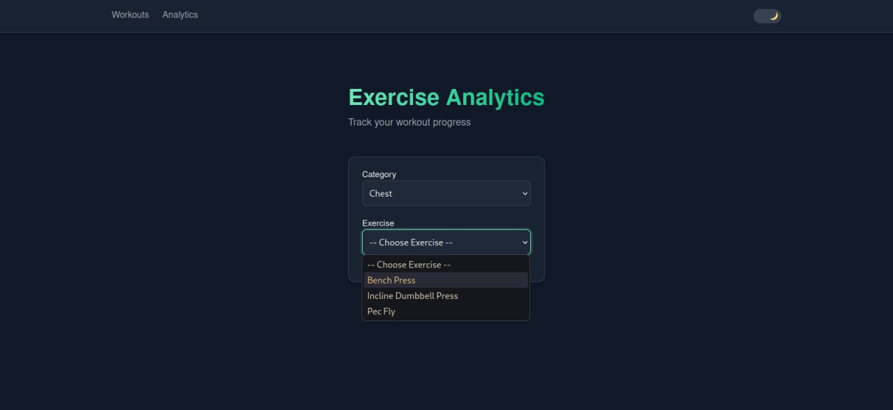
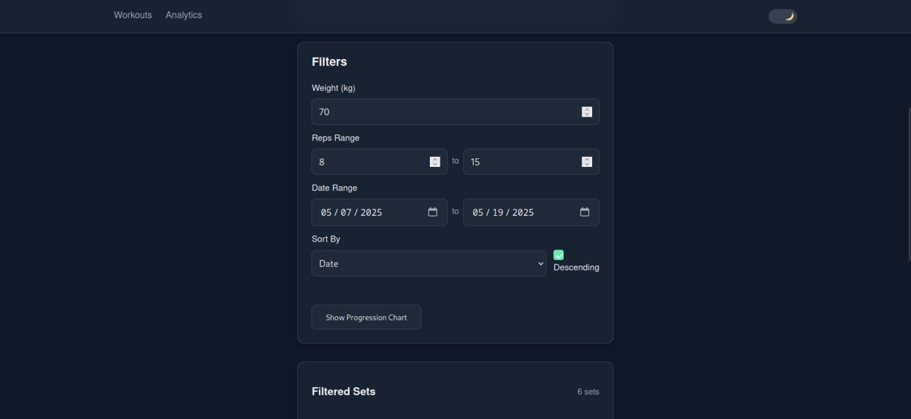
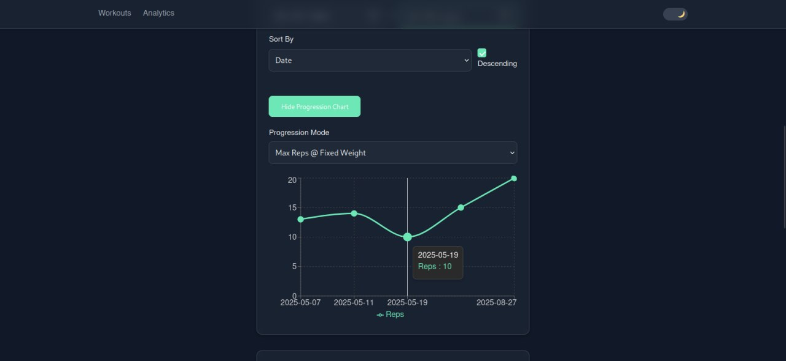
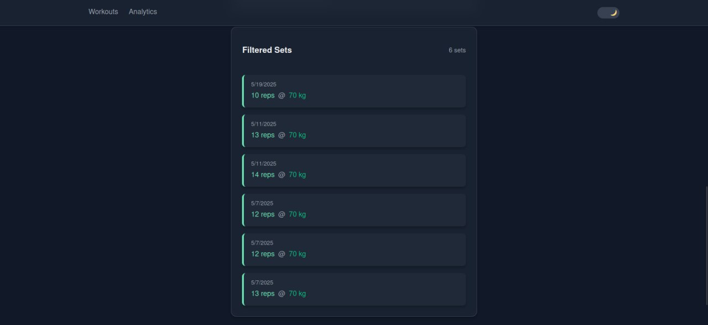

# Workout Tracker Application

A modern workout tracking web application with analytics visualization, built with React.

## Features

- **Workout Management**:
  - Create, view, edit, and delete workouts
  - Track exercises and sets for each workout
  - Add ratings and comments to workouts

- **Exercise Analytics**:
  - Visualize progress with interactive charts
  - Filter by exercise, weight, reps, and date ranges
  - Track progression over time

- **User Experience**:
  - Dark/light theme toggle
  - Responsive design for all devices
  - Data persistence using browser storage

- **Technical Features**:
  - React functional components with hooks
  - React Router for navigation
  - Recharts for data visualization
  - GitHub Pages deployment

## Live Demo

Try the application live: [https://renat03.github.io/PW-Lab-6/](https://renat03.github.io/PW-Lab-6/)

## Screenshots

`Add Workout Page`

`Add Workout Page with Light Theme`

`Workouts List`

`Workout Description`

`Exercise Description`

`Filter Page 1`

`Filter Page 2`

`Progression Chart`

`Filtered Results`

